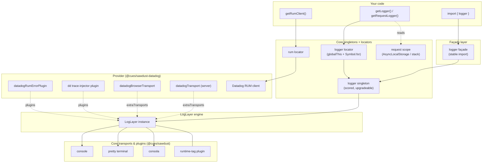
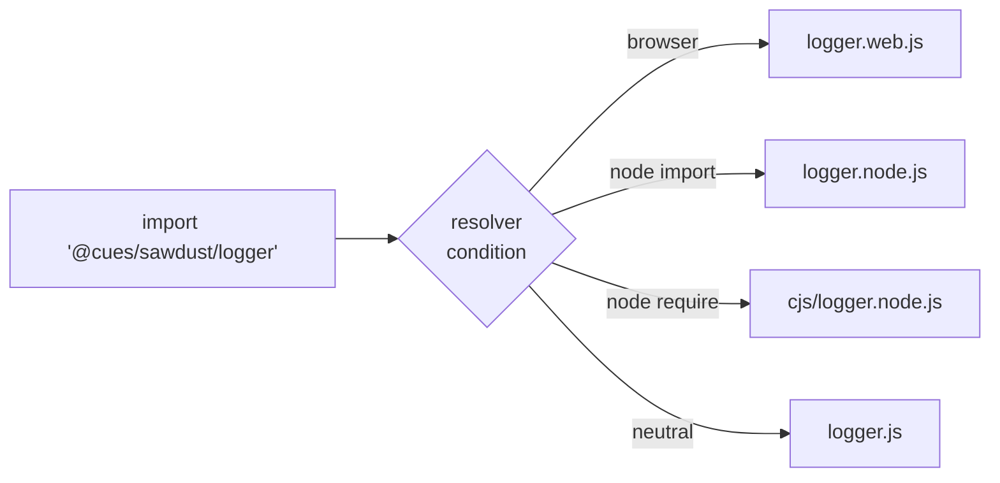

# Architecture

Sawdust is a thin, opinionated layer over [LogLayer](https://loglayer.dev). It adds four things
LogLayer does not prescribe: a **stable façade**, a **scored singleton**, **service locators**,
and **runtime-conditional builds**.

## The big picture



Core (`@cues/sawdust`) is **provider-agnostic**: it wires only its own console/pretty/consola
transports and the runtime-tag plugin. Datadog logs, APM trace injection, and RUM live in the
separate `@cues/sawdust-datadog` package and attach through two generic seams —
`extraTransports` (transports) and `plugins` (LogLayer plugins).

- **Façade (`logger`)** — a stable object you import once. It always delegates to the current
  canonical singleton, so upgrades never break existing imports.
- **Singleton** — the canonical logger, chosen by a scoring rule (`stage` + transport richness).
  `configureLogger` / `adoptExternalLogger` propose candidates; only stronger ones win.
- **Service locators** — `globalThis` slots keyed by `Symbol.for(...)`, so every bundle copy
  (Node, web, generic) points at the same instance. Exposed as `getLogger` / `setLogger` /
  `resetLoggerLocator` and the RUM equivalents.
- **LogLayer engine** — does the actual formatting and fan-out to transports/plugins.
- **Request scope** — `AsyncLocalStorage` on Node (stack emulation on web) that merges
  per-request bindings into every log.

## Runtime-conditional builds

The package ships `.node` and `.web` variants of the runtime-sensitive modules. The `exports`
map in `package.json` resolves the correct one automatically — you import a bare specifier and
never pick a build by hand.



The same split applies to `request-scope` and the locators. This is why `AsyncLocalStorage`
(Node-only) never leaks into a browser bundle. The RUM locator uses the identical `.node` /
`.web` technique, but now lives in `@cues/sawdust-datadog` (`rum.node.ts` / `rum.web.ts`).

## Why service locators (not module singletons)

A plain module-level `let instance` breaks when a bundler emits duplicate copies of a module —
each copy gets its own variable and the instances drift. Sawdust stores state on `globalThis`
under a **shared symbol**:

```typescript
export function createLocator<T>({ key, createDefault }: { key: symbol; createDefault: () => T }) {
  const g = globalThis as Record<PropertyKey, unknown>
  const getBox = (): { value: T } => {
    if (!g[key]) g[key] = { value: createDefault() }
    return g[key] as { value: T }
  }
  return {
    get: () => getBox().value,
    set: (v: T | null | undefined) => (getBox().value = v ?? createDefault()),
    reset: () => { getBox().value = createDefault() },
  }
}
```

Because `Symbol.for('sawdust.logger.locator')` resolves to the **same** symbol across every
bundle copy and runtime, Node, web, and generic modules all mutate one slot. See
[Service Locator](./service-locator.md) for the full rationale and migration story.

## Module map

**Core — `@cues/sawdust`**

| Concern | Modules |
|---|---|
| Façade | `logger.facade.ts`, `logger.ts` |
| Singleton + scoring | `logger.singleton.ts` |
| Locators | `createLocator.ts`, `loggerLocator*.ts` |
| Runtime builds | `*.node.ts`, `*.web.ts` |
| Request scope | `request-scope*.ts`, `AsyncLocalStorageContextManager.ts` |
| Core transports | `createConsoleTransport*`, `createPrettyTransport`, `createConsolaTransport*` |
| Plugins | `createRuntimeTagPlugin.ts` |
| Errors & context | `formatError.ts`, `serializeError.ts`, `sanitizeRecord.ts`, `loggerUtils.ts` |

**Provider — `@cues/sawdust-datadog`**

| Concern | Modules |
|---|---|
| Server logs + browser logs | `createDatadogTransport.ts`, `createDatadogBrowserLogsTransport.ts` (`index.ts` / `browser.ts` factories) |
| APM trace injection | `createDatadogTraceInjectorPlugin.ts` |
| RUM | `rum.node.ts`, `rum.web.ts`, `rumLocator*.ts`, `makeRumErrorPlugin.ts` |

Continue to [Sequence Flows](./sequence-flows.md) to see these interact over time.
