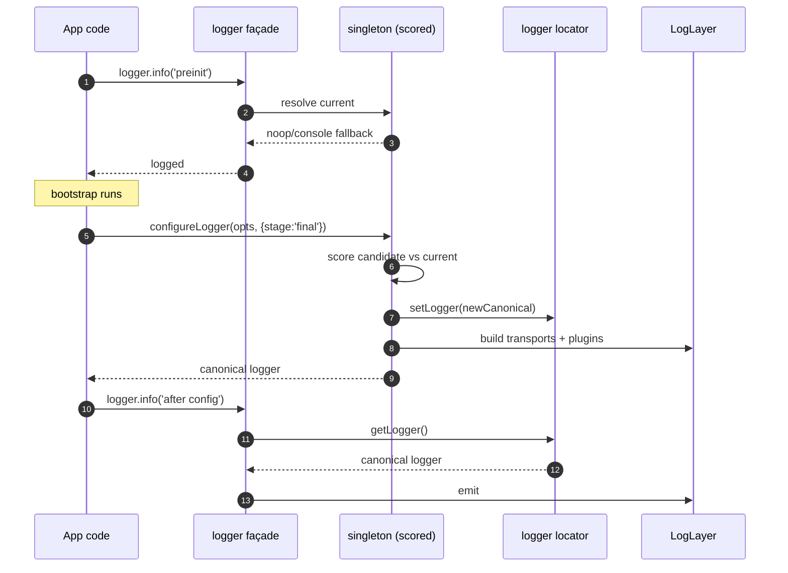
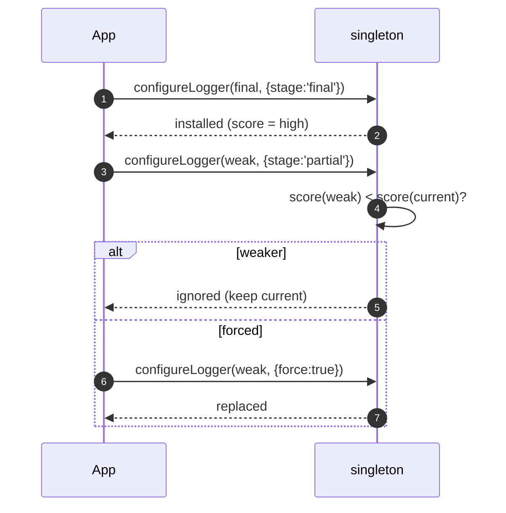
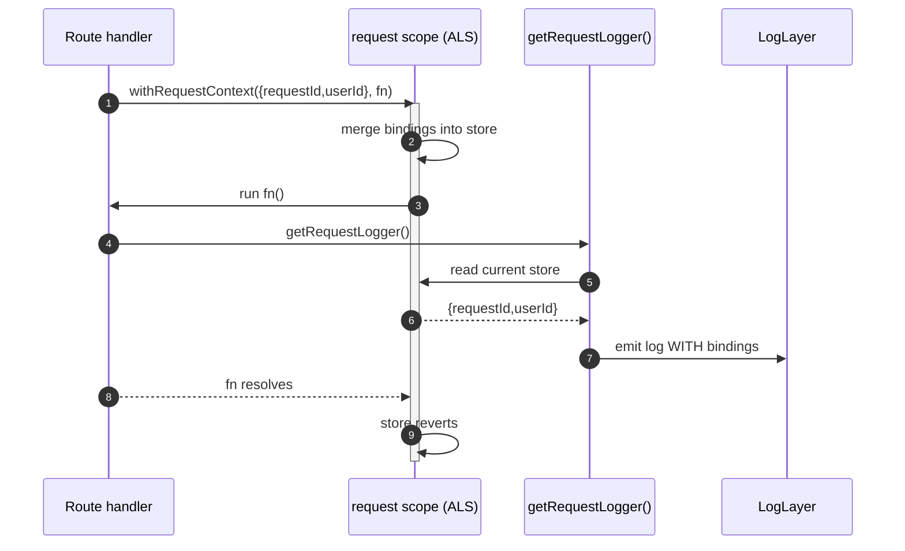
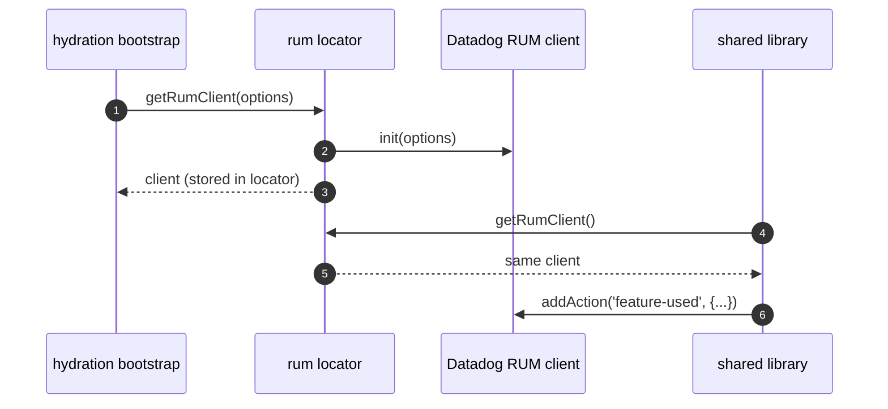

# Sequence flows

These diagrams trace the runtime interactions behind the everyday APIs.

## Bootstrap & in-place upgrade

The façade is usable before configuration and upgrades without breaking existing imports.

## Downgrade protection

A weaker candidate cannot replace a stronger canonical logger unless `force: true`.

## Request-scoped logging

`withRequestContext` binds metadata for the lifetime of the callback.

## RUM locator

See [Singleton & Scoring](./singleton-scoring.md) for how a candidate's score is computed.
